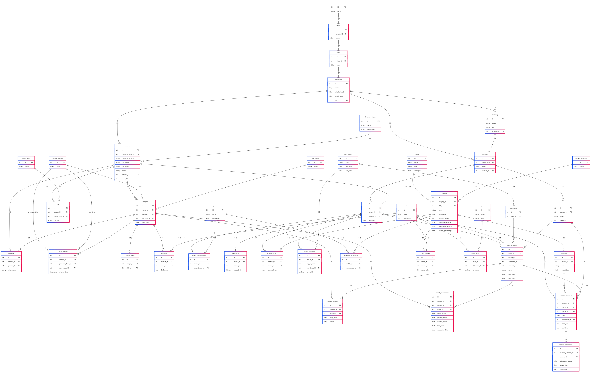

# Proyecto Campuslands_db

## Descripción del proyecto

CampusLands_db es un sistema de gestión académica diseñado para el programa intensivo de programación de CampusLands. Su objetivo principal es administrar eficientemente toda la información relacionada con el seguimiento académico de los campers, incluyendo inscripciones, rutas de aprendizaje, evaluaciones, asignación de trainers y gestión de áreas de entrenamiento.

## Requisitos del Sistema

Para ejecutar este proyecto es necesario contar con MySQL Server, MySQL Workbench y Git para clonar el repositorio.

## Instalación y Configuración

- Ejecute el script [ddl.sql](ddl/ddl.sql) para crear la estructura de la base de datos
- Ejecute el script [dml.sql](dml/dml.sql) para cargar los datos iniciales

Para realizar las consultas y funcionalidades avanzadas ejecute:
- [dql_select.sql](dql_select/dql_select.sql): Consultas
- [dql_procedimientos.sql](dql_procedimientos/dql_procedimientos.sql): Procedimientos almacenados
- [dql_funciones.sql](dql_funciones/dql_funciones.sql): Funciones
- [dql_triggers.sql](dql_triggers/dql_triggers.sql):  Triggers

## Estructura de la Base de Datos

El modelo de datos incluye las siguientes tablas principales:
- Campers: Almacena información personal y académica de los estudiantes
- Rutas: Contiene las diferentes rutas de aprendizaje
- Modulos: Detalla los módulos que componen cada ruta
- Evaluaciones: Registra los resultados académicos de los campers
- Trainers: Gestiona la información de los instructores
- AreasEntrenamiento: Administra los espacios físicos para las clases

Diagrama campuslands_db: 

## Ejemplos de Consultas
